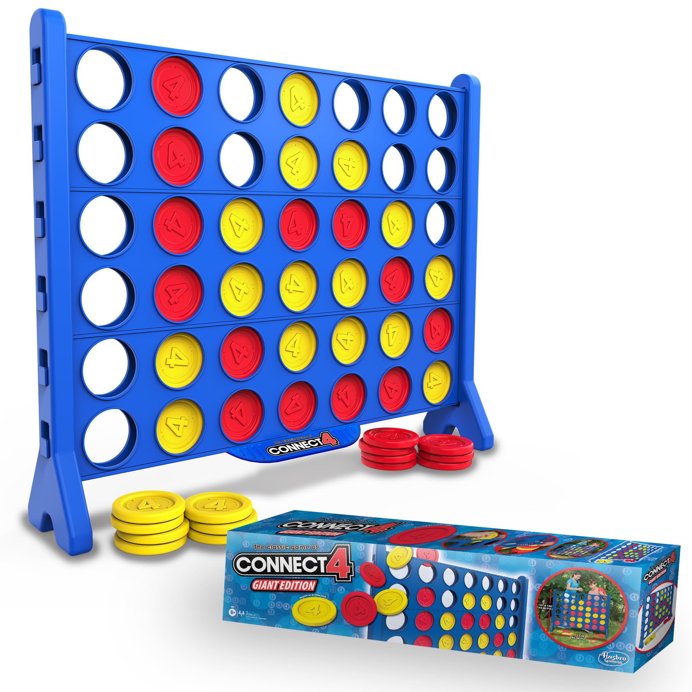

# connect4-clionly

# By Dominic Simpson and Osman Teklies - a Hackathon project for La Fosse




### I have many good memories of playing Connect Four as a kid, back when board games where still a big thing (not sure if they are still are in the digital 21st century age). Connect Four (also known as Connect 4, Four Up, Plot Four, Find Four, Captain's Mistress, Four in a Row, Drop Four, and in the Soviet Union, Gravitrips) is a game in which the players choose a colour and then take turns dropping coloured tokens into a six-row, seven-column vertically suspended grid. The pieces fall straight down, occupying the lowest available space within the column. The objective of the game is to be the first to form a horizontal, vertical, or diagonal line of four of one's own tokens. It is therefore a type of m,n,k-game (7, 6, 4) with restricted piece placement. Connect Four is a solved game; the first player can always win by playing the right moves.

### A gameplay example shows the first player starting Connect 4 by dropping one of their yellow discs into the center column of an empty game board. The two players then alternate turns dropping one of their discs at a time into an unfilled column, until the second player, with red discs, achieves a diagonal four in a row, and wins the game. If the board fills up before either player achieves four in a row, then the game is a draw.

### I have loosely used the template taken from my [Theseus & the Minotaur](https://dominicsimpson.github.io/facprojectsix/) project when constructing the Board class for this project. However, that project used HTML and CSS files alongside my JavaScript, allowing the JavaScript to target DOM elements. In this project, by contrast, we are relying on using the Command Line Interface (CLI) only. Therefore, there is no DOM representation, and no HTML and CSS files.
### There is only JavaScript.


## PSEUDOCODE:

```
Create Game class { 
  to hold Board + Player 1 + Player 2 objects;
  each game is an instance of Game class, contains all other classes?
}

Create Board class {
  check grid state, function dropPiece, function checkWin, function checkDraw, display new grid state;
  create Connect4 board grid object; 
  create 6 x 7 board:
    create columns = [1, 2, 3, 4, 5, 6, 7]
    create rows = [1, 2, 3, 4, 5, 6]

    displayBoard method {
      print board to CLI;
    }

    dropToken {
      drop player token into vacant circle slot
    }
}

create Player class {
  Player 1 & Player 2 subclasses;
  Player class - base class for Player 1 & Player 2, contains playerInput;
    constructor(name, tokenColour){
        this.name = prompt(`Please enter ur name innit: `)
        this.token = token
    }

    Create object? - {
    "player1": yellowToken,
    "player2": redToken
    }
}

// need to delineate each slot circle (A1, A2, A3)

   
// Populates the grid with each circle via a nested loop. X and Y are based on the normal coordinate system of
// x: horizontal axis, y: vertical axis

Visual representation of board:
[0, 0, 0, 0, 0, 0, 0], // 0 represents empty circle; 1 represents if circle is filled by coloured token


connect4board = {
  grid: [
    column 0 / column 1 / column 2 / column 3 / column 4 / column 5 / column 6
    [0, 0, 0, 0, 0, 0, 0], // row 0 (top)
    [0, 0, 0, 0, 0, 0, 0], // row 1
    [0, 0, 0, 0, 0, 0, 0], // row 2
    [0, 0, 0, 0, 0, 0, 0], // row 3
    [0, 0, 0, 0, 0, 0, 0], // row 4
    [0, 0, 0, 0, 0, 0, 0], // row 5
  ],
  player1: {
    x: 0,
    y: 0,
  },
  player2: {
    x: 0,
    y: 0,
  },
};


if (circle slot is empty) {
    drop token into circle slot;
    else slot circle is not empty
}

Winner logic:
HORIZONTAL:    [x][x][x][x]
VERTICAL:      [x]
                |
               [x]
                |
               [x]
                |
               [x]

DIAGONAL (\):  [x]
                 [x]
                   [x]
                     [x]

DIAGONAL (/):        [x]
                    [x]
                   [x]
                  [x]


```


